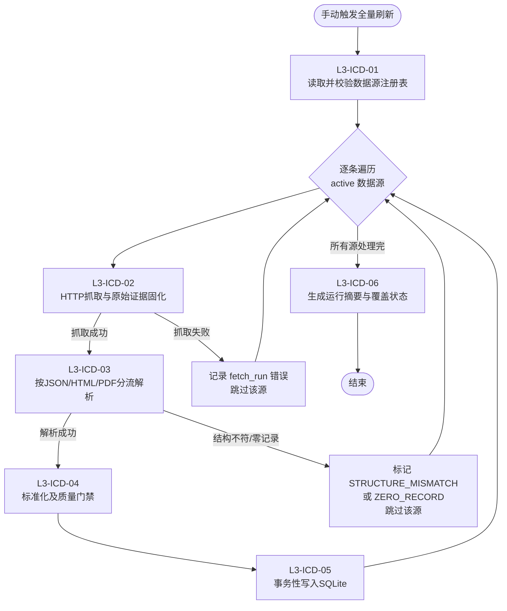

# ICD · 流程设计（L3 端到端）

> Agent ID: ICD（Insurer Compliance Disclosures）
> 版本: v0.1.0
> 日期: 2026-09-03
> 阶段: SOP 第2步——流程设计（ICD-T001）
> 配套文件: `../02_配置项目_Configure_Project/source_registry.json`（数据源注册表）、`data_contract.md`（数据契约/SQLite Schema）

## 一、设计原则

1. **只设计、不实现**：本文只固定 L3 边界、输入输出、失败语义与 skill/tool 归属，不写采集/解析/入库代码。
2. **按格式分流，不按险企分流**：解析层按 JSON / HTML表格 / PDF 三条支线组织，而不是每家险企一个模块（对齐需求定义九节建议）。
3. **一条证据链**：每个业务记录都必须能回溯到 `fetch_run`（抓取运行）→ `data_source`（真实 URL）→ `insurer`（险企），且原始快照先落盘再标准化。
4. **部分失败可继续**：一家险企失败不默认回滚其他险企；但同一数据源的解析+入库必须原子化。
5. **失败不等于"无数据"**：HTTP 成功但页面结构不符，标记 `STRUCTURE_MISMATCH`，绝不写成"该险企无数据"。

## 二、L3 流程总览（Mermaid）

> 说明：L3-02 → L3-05 是"逐数据源"的循环体；L3-06 是循环结束后的一次性聚合。单个数据源在 L3-02 / L3-03 / L3-04 任一环节失败，都只跳过该源、不中断其它源。

## 三、L3 明细表

| L3 编码 | 名称 | 输入 | 输出 | 对应 skill/tool | 失败语义 | 是否允许继续处理其他数据源 |
|---|---|---|---|---|---|---|
| L3-ICD-01 | 读取并校验数据源注册表 | `source_registry.json` | 内存中的有效数据源列表（`insurer_code` / `disclosure_type` / `entry_url` / `format` / `access_status`） | `tools/registry_loader.py` | 注册表整体不可解析或 schema 不合规 → **硬失败，终止运行**；单条 `access_status ∈ {BLOCKED, UNVERIFIED}` → 跳过并记日志 | 整体失败则终止；单条跳过可继续 |
| L3-ICD-02 | HTTP抓取与原始证据固化 | 单个 `data_source` 条目 | `fetch_run` 记录 + 原始快照文件（落盘 `raw/` 目录）+ `content_hash` | `skills/fetch_disclosure.py` | HTTP 4xx/5xx、网络超时 → 记录 `fetch_run(fetch_status=错误)`，跳过该源；**原始快照必须先成功落盘，才允许进入下一步** | 允许（跳过该源，继续其他源） |
| L3-ICD-03 | 按JSON/HTML/PDF分流解析 | `fetch_run` + 原始快照 | 按格式产出的结构化中间记录（原始字段，未标准化） | `skills/json_disclosures.py` / `skills/html_table_disclosures.py` / `skills/pdf_disclosures.py` | 页面/文件结构不符 → 标记 `STRUCTURE_MISMATCH`（不得写"无数据"）；**零记录解析是硬失败**，除非注册表 `allows_empty=true` | 允许（跳过该源，继续其他源） |
| L3-ICD-04 | 标准化及质量门禁 | 结构化中间记录 | 标准化记录（`fulfillment_ratio` / `rbc_statement` 形态）+ 质量门禁结果 | `skills/standardize_disclosures.py` | 数值不可解析 → 保留 `raw_value`、`normalized_value=NULL` 并标记；`AD/TD/TCV/REVERSIONARY` 不得合并；`report_year` 与 `observation_year` 不得混列 | 允许（该源门禁失败仅该源跳过） |
| L3-ICD-05 | 事务性写入SQLite | 通过门禁的标准化记录 + `parse_result` | 已提交的 SQLite 行（按数据源一个事务） | `tools/sqlite_store.py` | **同一数据源的写入原子化**（要么全成功要么全回滚）；一家险企失败不默认回滚其他险企 | 允许（跨源独立，互不回滚） |
| L3-ICD-06 | 生成运行摘要与覆盖状态 | 本轮所有数据源的处理结果 | 运行摘要报告（JSON+Markdown）+ `coverage_status` 表更新 | `skills/run_all.py`（编排）+ `skills/summary_writer.py`（摘要）+ `tools/coverage_writer.py`（覆盖 upsert） | 摘要生成失败为 best-effort，不回滚已提交数据 | 不适用（聚合步骤） |

## 四、各 L3 详细说明

### L3-ICD-01 · 读取并校验数据源注册表

- **职责**：加载 `source_registry.json`，校验其 schema（必填字段齐全、`insurer_code` 唯一、`access_status` 取值合法），产出本轮要处理的数据源列表。
- **过滤规则**：`access_status = BLOCKED`（宏利全站 Akamai）与 `UNVERIFIED`（8 家 RBC 未实测 URL）在 L3-01 即被标记为"本轮不抓取"，进入覆盖状态表而非直接抓取。
- **失败语义**：注册表 JSON 无法被标准库解析，或缺少 `insurers` / `sources` 关键结构 → 硬失败，抛出，终止整轮运行（宁可不跑，也不带脏配置跑）。
- **边界**：不在此处做任何网络访问；只做静态校验。

### L3-ICD-02 · HTTP抓取与原始证据固化

- **职责**：对单个数据源发起 HTTP GET（纯 HTTP，`curl`/`urllib` 级别，不执行 JS），把**原始字节**按 `content_hash` 命名落盘到 `raw/{insurer_code}/{source_id}/`，并写入一条 `fetch_run`。
- **关键次序**（哈希命名与落盘的先后关系，修正 R1 反馈）：
  1. HTTP 响应体完整读入内存，得到原始字节；
  2. 对内存字节计算 `content_hash`（SHA-256）——哈希在此时即已确定；
  3. 把原始字节写入**临时文件** `raw/{insurer_code}/{source_id}/.tmp-{uuid}.bin`；
  4. 用原子重命名（`os.replace`）把临时文件改名为**以哈希命名的最终路径** `raw/{insurer_code}/{source_id}/{content_hash}.bin`；
  5. 最终路径确认落盘后，才写入 `fetch_run`（`content_hash` 与 `snapshot_path` 均非空）。
  任一步 I/O 失败 → 本源失败，不写成功型 `fetch_run`，不得继续解析；因哈希在第 2 步已算出，故不存在"先定最终哈希路径、后算哈希"的矛盾。
- **幂等**：若本次 `content_hash` 与该源最近一次**成功**抓取的哈希相同，判定"无新版本"，不重复落盘、不重复解析（详见 data_contract.md 幂等策略）。失败抓取 `content_hash = NULL`，不参与哈希去重，每次失败单独记录。
- **失败语义**：HTTP 4xx/5xx、超时、连接失败 → 记 `fetch_run`（`http_status` / `error_code`），跳过该源。日志不得包含 Cookie、凭证或完整请求头。
- **注意**：宏利 `requires_browser=true` 的源在 L3-01 已被过滤，不会走到这一步；本步不引入 Selenium/Playwright。

### L3-ICD-03 · 按JSON/HTML/PDF分流解析

- **职责**：根据 `format` 字段把快照分派到三条支线之一：
  - `json` → `skills/json_disclosures.py`（友邦静态 JSON：`report_year` + `pData` 数组，`AD`/`TD` 逐年 `ratio`）
  - `html` → `skills/html_table_disclosures.py`（万通/永明/周大福/中银/中国人寿海外纯 `<table>`；AXA/FWD 为 Next.js SSR，需先取 `__NEXT_DATA__` 或进入子页）
  - `pdf` → `skills/pdf_disclosures.py`（友邦/保诚 RBC 披露声明；保诚履行率 PDF 为 IRR 数据）
- **失败语义**：HTTP 成功但结构不符（找不到预期 table / JSON 键 / PDF 章节）→ 标记 `STRUCTURE_MISMATCH`，**绝不写成"无数据"**；解析出 0 条记录 → `ZERO_RECORD` 硬失败，除非注册表该源 `allows_empty=true`。
- **边界**：只产出"原始字段"的中间记录，不做口径合并、不做百分比换算。

### L3-ICD-04 · 标准化及质量门禁

- **职责**：把中间记录标准化为两类业务实体：
  - 分红实现率 → `fulfillment_ratio`（`dividend_type ∈ {AD, TD, TCV, REVERSIONARY, OTHER}`，`report_year` 与 `observation_year` 分开）
  - RBC → `rbc_statement`（偿付能力比率 + 资本基础 + 规定资本额 + 币种 + 可选风险分解）
- **口径规则（审计重点）**：
  - `AD`（周年红利）/ `TD`（终期红利）/ `TCV`（总现金价值比率）/ `REVERSIONARY`（永明"归原红利"）**是四个不同口径，绝不允许合并成一行或一个数字**。
  - `report_year`（披露报告年度）与 `observation_year`（比率对应的保单/观察年度）**是两列，绝不混为一列**。
  - 百分比统一存储为小数比率（94% → 0.94，304% → 3.04），原始字符串保留在 `raw_value`（详见 data_contract.md）。
- **失败语义**：某值无法解析为数字 → 保留 `raw_value`、`normalized_value=NULL` 并写 `parse_result` 提示；门禁拒绝的整条记录不入库，但不影响该源其他记录。

### L3-ICD-05 · 事务性写入SQLite

- **职责**：把通过门禁的记录按**单个数据源**包装成一个事务写入 SQLite；同时写入 `parse_result`。
- **原子性边界**：同一数据源（同一次抓取）的所有 INSERT 要么全部提交、要么全部回滚；**不同险企/不同数据源之间互不回滚**。
- **幂等**：业务表用"自然业务键 + `run_id`"做唯一约束，重复处理同一次抓取不会产生重复行（详见 data_contract.md）。

### L3-ICD-06 · 生成运行摘要与覆盖状态

- **职责**：聚合本轮所有源的结果，输出运行摘要（每家险企 × 每类数据：成功/失败/覆盖状态），并更新 `coverage_status` 表（`FULL` / `PARTIAL` / `MISSING` / `BLOCKED` / `UNVERIFIED`）。
- **实现（T009）**：批次入口 `--run-all`（`agents/agent.py` + `skills/run_all.py`）按固定 `source_id` 顺序遍历 `is_active=1` 的源，逐源复用 `fetch_disclosure` / `parse_disclosure` / `rbc_index_discovery`；`BLOCKED` / `UNVERIFIED` / `requires_browser` 跳过（不发网络请求），未接入源标 `unsupported`，单源失败隔离。聚合阶段由 `tools/coverage_writer.py` 按自然键 UPSERT `coverage_status`，`skills/summary_writer.py` 以唯一 run_id 写入 JSON+Markdown 摘要（受控 `summaries/` 目录，不覆盖历史）。
- **覆盖状态优先级（确定性）**：全部源 BLOCKED/浏览器 → `BLOCKED`；全部源 UNVERIFIED → `UNVERIFIED`；否则按业务记录判定（至少一源 `records_written>0` 或索引确定性定位成功）：全可处理源成功 → `FULL`，部分成功 → `PARTIAL`，无成功 → `MISSING`。`parse_result=PARTIAL`（值不可数值化但 `records_written>0`）仍计为覆盖成功，不误判为覆盖缺失。
- **失败语义**：摘要生成失败不影响已提交数据，仅记录日志。

## 五、失败与证据规则（对齐任务书 D 项）

| 规则 | 落实位置 |
|---|---|
| HTTP 成功但结构不符 → `STRUCTURE_MISMATCH`，不得写"无数据" | L3-ICD-03 |
| 零记录解析是硬失败，除非 `allows_empty=true` | L3-ICD-03 / 注册表字段 |
| 原始快照先成功落盘，再允许标准化入库 | L3-ICD-02 次序 |
| 一家险企失败不默认回滚其他险企；同一来源写入原子化 | L3-ICD-05 |
| 日志不含凭证/Cookie/完整请求头 | L3-ICD-02 |

## 六、L3 ↔ 数据契约表映射

| L3 | 写入/依赖的数据表 |
|---|---|
| L3-ICD-01 | 读取 `source_registry.json`（对应 `data_source` 表结构） |
| L3-ICD-02 | `fetch_run`（+ 原始快照文件） |
| L3-ICD-03 | （中间态，不落表；结果经 L3-04 标准化） |
| L3-ICD-04 | 产出 `fulfillment_ratio` / `rbc_statement` / `rbc_risk_component` 形态 |
| L3-ICD-05 | 事务写入 `fetch_run` / `fulfillment_ratio` / `rbc_statement` / `rbc_risk_component` / `parse_result` |
| L3-ICD-06 | 更新 `coverage_status` |
